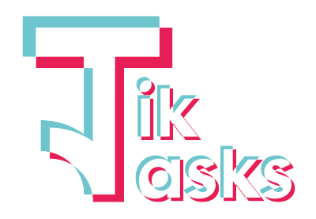

<a href="http://phplaravel-702697-2360337.cloudwaysapps.com/" target="_blank">Go to Website</a>

## Disclaimer
The product Tik Tasks exists as a web application for educational purposes and has no affiliations
with similar brands nor is intended for commercial usage.
While Tik Tasks GmbH assures to deliver high quality products, we can not
guarantee any absence of bugs or defects in the product.
Under no circumstance is Tik Tasks liable for any direct, indirect, specific or
consequent damages that is inflicted by the use, misuse, abuse or inability to
use the software.
The attached Manual does not contain all details or variations of the software nor
does it provide guidance or maintenance for any possible contingency.

## About Tik Tasks

Tik Task provides a simple tool to create to-do-lists and additionally has the
capability to use different user profiles with different limits of usage.
Tik Tasks bestows the user with a synoptic interface to ideally increase productivity
and user experience.
The three different user roles are:

### "Worker"
This is the default user role. The user has full access to managing tasks,
personal data and preferences/settings.

### "Administrator"
This role maintains any permissions of the worker role. Additionally this user
can manage other users, e.g. delete or edit them.

### "Manager"
This role maintains any permissions of the worker role. Additionally this user
can see any public tasks created by other users and assign tasks to them.

## Manuals
<a style="text-decoration:none" href="Tik_Task_Software_Manual___EN.pdf" target="_blank">English Manual</a>  
<a style="text-decoration:none" href="Tik_Tasks_Software_Manual__DE.pdf" target="_blank">German Manual</a>

